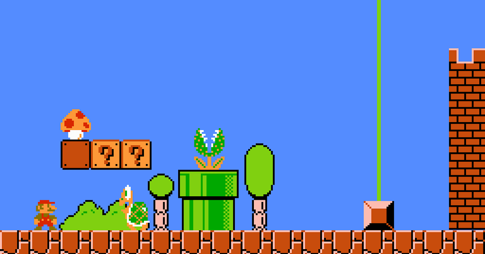

# 1.3 Research

## Super Mario Bros.

<figure><figcaption></figcaption></figure>

### Overview

The original Super Mario game, released in 1985 for the Nintendo Entertainment System (NES), is widely regarded as one of the most influential video games of all time. The gameplay consists of side-scrolling levels where the player controls Mario as he runs, jumps, and avoids obstacles while collecting coins and power-ups. The game also features a memorable soundtrack and colourful graphics that have become iconic.

### Controls

Updated versions of the game allow for it to be played on any console including PC. Controls while using a keyboard include arrow keys used for movement (left and right to move, up to jump, and down to crouch). The Z key may be used for running or jumping, and the X key or spacebar for attacking or throwing fireballs (if the player has the corresponding power-up). If using a controller, the game's controls are simple and intuitive, with the directional pad used for movement, the A button for jumping, and the B button for shooting fireballs.&#x20;

### Story Line

The game follows the adventures of Mario, an Italian plumber, who has to rescue Princess Peach from the evil Bowser, the king of the Koopas. When Mario hears of the Kidnapping, he has to journey through 8 different worlds and their various obstacles, to reach Bowser's castle and defeat him. As mentioned before, along the way, Mario collects coins, power-ups, and other helpful items to aid him in his quest.

The finale of each level involves Mario jumping on a flag pole and then running into a castle. This happens for all of the levels apart from the finale in Bowsers Castle. In the finale, Mario has to defeat Bowser to then save Peaches.

### Features



| Feature       | Justification                                                                                                                                                               |
| ------------- | --------------------------------------------------------------------------------------------------------------------------------------------------------------------------- |
| Controls      | I like the simple and easy-to-understand controls used in Mario. The arrow keys with an extra key for powerups.                                                             |
| One Character | I prefer single-player aspects to a game. This makes the plot far simpler and more fundamental.                                                                             |
| Enemies       | I like the simple to defeat enemies in Mario, especially with a powerup. However, I will have 1 enemy fighting the player at a time.                                        |
| Graphics      | I like the pixelated graphics giving it a retro feel. I feel it would suit my game for its theme.                                                                           |
| Background    | The subtle background touches that Mario has with bushes, pipes, etc. I like these features. However, I would change them to suit my theme.                                 |
| Powerups      | I like the feature of picking up items for health/strength boosts. My game will include them but changed to suit the themes. Coins replaced with water bottles for example. |



| Feature | Justification                                                                                                                                                                                                                                           |
| ------- | ------------------------------------------------------------------------------------------------------------------------------------------------------------------------------------------------------------------------------------------------------- |
| Finale  | In the example screenshot for the original Mario, the ending includes a flag pole that the player has to get as high as possible on. I would rather have a final boss that is the same theme as the other enemies but is stronger and harder to defeat. |



## Street Fighter

<figure><figcaption></figcaption></figure>

### Overview

Street Fighter is a classic arcade fighting game that was released by Capcom in 1987. The game would eventually lead on to be the first of a series of fighting games that became one of the most popular franchises in video game history. Street Fighter introduced the concept of a health bar and rounds, with players fighting in a best-of-three format. The game featured a range of opponents with different fighting styles, and the difficulty increased as players progressed through the game.

### Controls

The game's original version featured two playable characters, Ryu and Ken. The 2 players would choose between them which character and the fight began. The game was played with a joystick and six buttons, allowing players to execute a variety of attacks and special moves. The game's most prominent feature was the ability to do special moves by inputting specific button combinations, such as Ryu's Hadoken fireball or Ken's Shoryuken uppercut. These moves required precise timing and button inputs, which added a layer of depth to the gameplay and made it stand out from other fighting games of the time.

### Story Line

The story of the Street Fighter series involves a series of tournaments, battles, and political struggles as Ryu and his allies fight to stop the main antagonist, M. Bison, and his evil plans. Along the way, they must fight other fighters to get to the final enemy Bison.

### Features



| Feature                  | Justification                                                                                                                                                                                                                                       |
| ------------------------ | --------------------------------------------------------------------------------------------------------------------------------------------------------------------------------------------------------------------------------------------------- |
| Enemy Type and system    | I love the idea of aiming for a final boss after fighting weaker opponents beforehand. There will be one enemy fighting the player at a time, making it feel like the journey of a Boxing/Karate/Mixed Martial Arts World Champion.                 |
| Punch Animations         | I like the punch animations from the original Street Fighter. The arcade-style punch includes 2 frames; the default standstill frame, and the arm-stretched punch frame.                                                                            |
| Punch Graphics/Particles | When a character in Street Fighter punches there are small particles. It is a nice feature that will make my game look nicer and more professional.                                                                                                 |
| Health Bars              | I want my player character to have a health bar. Additionally, I want the final boss to have a health bar. However, I won't have the opponents in between have a health bar as I wish for them to be easier to kill - 1-2 hits per enemy to defeat. |



| Feature              | Justification                                                                                                                                                                                                                                                                                                                                                             |
| -------------------- | ------------------------------------------------------------------------------------------------------------------------------------------------------------------------------------------------------------------------------------------------------------------------------------------------------------------------------------------------------------------------- |
| Fighter Combinations | My game is a platformer so the fighting aspect of the game will not be the whole plot. The plot is to move across multiple pages/slides to get to the final boss while quickly fighting other opponents. Combinations will add unneeded complexity to the game and will be unnecessary when the final boss is the only enemy with enough health to require a combination. |
| Kicking              | My game will only include punching as a way of fighting opponents - like the sport of boxing.                                                                                                                                                                                                                                                                             |



## Broforce

<figure><figcaption></figcaption></figure>

### Overview

Broforce is a 2D side-scrolling platformer game developed by Free Lives and published by Devolver Digital. The game features action-movie heroes, referred to as "Bros", who must fight against terrorists and aliens in a series of missions. The game also features a variety of game modes, including a single-player campaign, local co-op multiplayer, and online multiplayer. In the co-op version, players team together to complete the missions. In the versus mode, players compete against each other.

### Format/Story Line

The player's character spawns from a truck on the left side of the map. Then they have to traverse obstacles while defeating any enemies, which do not require much to be defeated. At the end of the side-scrolling map, there is a final boss that is much stronger and has a health bar. Along the way, the "Bro" can rescue other "Bros" from cages and are rewarded with extra lives.

The game's levels are destructible, allowing players to create new paths or take cover from enemy fire. The game has also got a feature where there is a variety of vehicles and weapons, including helicopters, tanks, and flamethrowers.

Broforce's storyline is presented in a comical manner, with a focus on silly characters, funny animations, and general humour. The game also pays tribute to classic action movies and pop culture references, making it a nostalgic and fun experience for players.

The level's in Broforce end when the player has defeated the final boss, the devil, has hoisted an American flag, and then leaves in a Helicopter while the scenery explodes. However, the Devils is only the final boss, the game features multiple bosses that the player has to defeat. For example, the Stealth Tank, the Acid Crawler, the Heart of The Hive, and many more.

An exciting feature that the developers of Broforce has added is the "Level Editor", where players are able to create their own maps using a "Robust Level Editor"

### Features



| Feature         | Justification                                                                                                                          |
| --------------- | -------------------------------------------------------------------------------------------------------------------------------------- |
| Format          | I intend to have a platform game that has the player spawn on one end and have to fight through enemies to reach the final boss.       |
| Player Movement | I like how the players move in Broforce. The controls are WASD or arrow keys. But I especially like how the player jumps in Broforce.  |
| Character       | I like the way the characters are drawn in this game. Their retro style would suit my game.                                            |



| Feature             | Justification                                                                                                                   |
| ------------------- | ------------------------------------------------------------------------------------------------------------------------------- |
| Destuctible Scenery | The fighting in my game will be similar to boxing. No surroundings will be destroyable for the player.                          |
| Gore/Violence       | My game will not include blood like Broforce does.                                                                              |
| Weapons             | I intend for my game to include punching. No special weapons will be picked up. Nor, vehicles like the helicopters in Broforce. |



