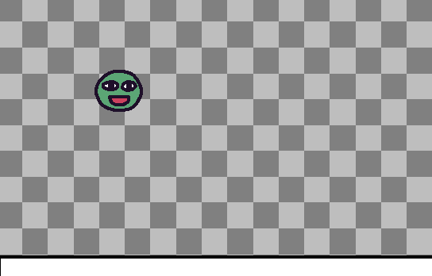

# 2.2.5 Cycle 5

### Design

In this cycle, I will be adding enemies and their movement. It is important that they spawn in the correct place, that being inside of the ring, and it is important that they move around the ring. I will use more symbols and temporary designs from kaboom.js.

The enemy will spawn at the opposite end of the boxing ring and will patrol the boxing ring. The same will apply to the boss.

### Objectives

* [x] Spawn in enemies
* [x] Enable movement for enemies

### Usability Features

Non-functional aspects: I want my enemies to not be too challenging for the player to defeat. After all, the PEGI rating is low to allow young children to play if they desire. With that being said, the enemy will move at a speed which is not too fast nor too slow.

### Key Variables

| Variable Name                               | Use                                                                                                                                                                                                                 |
| ------------------------------------------- | ------------------------------------------------------------------------------------------------------------------------------------------------------------------------------------------------------------------- |
| LEVELS                                      | This is an array of level layouts, where each level is represented as an array of strings. It defines the layout of the game levels.                                                                                |
| "0"                                         | This is a symbol used in the level layout strings, representing the spawn point for the "boss." When this symbol is encountered in the level layout, it creates a boss entity.                                      |
| ">"                                         | This is a symbol used in the level layout strings, representing a normal enemy. When this symbol is encountered in the level layout, it creates a standard enemy entity.                                            |
| sprite("bag")                               | This defines the temporary sprite made by Kaboom.js for the boss. Using "bag.png".                                                                                                                                  |
| sprite("ghosty")                            | This defines the temporary sprite made by Kaboom.js for the normal enemy. Using "ghosty.png".                                                                                                                       |
| area()                                      | This creates a collision area for the enemy entities.                                                                                                                                                               |
| anchor("bot")                               | This sets the anchor point of the enemy entities to the bottom.                                                                                                                                                     |
| body()                                      | This creates a physics body for the enemy entities.                                                                                                                                                                 |
| patrol()                                    | This represents a function or component that defines patrol behaviour for the enemies.                                                                                                                              |
| offscreen({ hide: true })                   | This likely defines an offscreen behavior for the entities, hiding them when they go offscreen.                                                                                                                     |
| "enemy"                                     | This is a tag or identifier for the enemy entities, allowing for collision detection with player entities.                                                                                                          |
| player.onCollide("enemy", (e, col) => {...} | This sets up a collision event handler for the player entity when it collides with an entity tagged as "enemy." If the collision is not on the bottom side of the player, it triggers the game over state ("lose"). |

### Pseudocode

```
Load sprite "enemy" from "/sprites/ghosty.png"
Load sprite "bag" from "/sprites/bag.png"

Define LEVELS as an array of level layouts, where each level is represented as an array of strings.

Define behaviours for specific symbols used in the level layouts:
- When encountering "0" in the level layout:
  - Create an entity with the following attributes:
    - Display the "bag" sprite
    - Define a collision area
    - Anchor at the bottom
    - Create a physics body
    - Apply a patrol behaviour
    - Set offscreen behaviour to hide
    - Tag the entity as "boss"

- When encountering ">" in the level layout:
  - Create an entity with the following attributes:
    - Display the "ghosty" sprite
    - Define a collision area
    - Anchor at the bottom
    - Create a physics body
    - Apply a patrol behaviour
    - Set offscreen behaviour to hide
    - Tag the entity as "enemy"

Define an event handler for when the player collides with entities tagged as "enemy":
  - If the collision is not on the bottom side of the player:
    - Transition to the "lose" state or perform a game-over action

```

## Development

### Outcome

Loading temporary sprites for the enemies

```javascript
loadSprite("enemy", "/sprites/ghosty.png")
loadSprite("bag", "/sprites/bag.png")
```

Adding symbols for enemies

```javascript
const LEVELS = [
	[
		"                                 ",
		"                                 ",
		"                                 ",
		"                                 ",
		"            -              -     ",
		"            -      >       -    @",
		"============----------------=====",
	],
	[
		"                                            ",
		"                                            ",
		"                                            ",
		"            -              -                ",
		"            -              -                ",
		"           --         >    -              @ ",
		"============----------------================",
	],
	[
		"                                                   ",
		"                                                   ",
		"                                    ---            ",
		"            -              -                       ",
		"           --              -                       ",
		"          ---           >  -                      @",
		"============----------------=====  ===  ===  ===  =",
	],
    [
		"                                                 ---------",
		"                                                --       @",
		"                                               --     ----",
		"            -              -                  --     --   ",
		"           --              -            -------     --    ",
		"          ---           >  -                       --     ",
		"============----------------============------------      ",
	],
	[
		"--------------------------------------------",
		"    -                                       ",
		"--- -                                       ",
		"  - -           -              -            ",
		"  - -          --              -            ",
		"  -           ---           0  -         @  ",
		"==---==========-----------------============",
	],
    
]
```

Declaring what each symbol represents. The "0" represents the spawn for the "boss" which is the final enemy. The ">" is the normal enemy.

```javascript
		"0": () => [
			sprite("bag"),
			area(),
			anchor("bot"),
			body(),
			patrol(),
			offscreen({ hide: true }),
			"boss",
		],
		">": () => [
			sprite("ghosty"),
			area(),
			anchor("bot"),
			body(),
			patrol(),
			offscreen({ hide: true }),
			"enemy",
		],
	},
}
```

This is the code for the "lose" scene which displays if the player gets defeated or falls off the map.

```javascript
	player.onCollide("enemy", (e, col) => {
		if (!col.isBottom()) {
			go("lose")

		}
	})
```

The code that defines my patrol function which allows my enemies to move horizontally back and forth. It uses a "speed" parameter to control the movement speed and reverses the direction when the enemy collides with the side of the boxing ring.

```javascript
function patrol(speed = 200, dir = 1) {
    return {
        id: "patrol",
        require: ["pos", "area"],
        add() {
            this.on("collide", (obj, col) => {
                if (col.isLeft() || col.isRight()) {
                    dir = -dir
                }
            })
        },
        update() {
            this.move(speed * dir, 0)
        },
    }
}
```

### Challenges

One big challenge in this section was the enemy movement inside the ring. Originally, my code involved the enemy walking towards the player as they stepped into the boxing ring. However, there was a bug where the enemy would sometimes get caught on one of the flour pieces, which is shown in this short clip:



You can see from this clip that the enemy, which is displayed as "ghosty", inside of the boxing ring gets caught on the right side. As a result of this, I changed my code so that the enemy patrols the boxing ring rather than targeting the player, this worked as a fix for this bug.

## Testing

Evidence for testing

### Tests

<table><thead><tr><th width="87">Test</th><th width="148">Instructions</th><th width="223">What I expect</th><th width="208">What actually happens</th><th>Pass/Fail</th></tr></thead><tbody><tr><td>1</td><td>Run code with new symbols representing enemies</td><td>Enemies spawn in the correct locations on each of the levels. </td><td>Upon test travelling the map, the enemies all spawn in their correct locations in the different boxing rings.</td><td>Pass</td></tr><tr><td>2</td><td>After adding the code for the enemy movement. Run the code and test that the enemies walk towards the player.</td><td>As the player enters the boxing ring, the enemy moves towards the player in attempt to defeat the player.</td><td>The enemys get caught on the sides of the boxing rings. Resulting in the enemies not walking towards the player and  rather getting stuck to a flour peice.</td><td>Fail</td></tr><tr><td>3</td><td>Adapt to the error, change the enemy movement code and run.</td><td>Enemies patrol back and fourth their individual boxing rings. Rather than walking towards the player so that the bug fixes.</td><td>The enemies correctly patrol the boxing ring with their new "patrol" function.</td><td>Pass</td></tr></tbody></table>

### Evidence

Here is a clip of testing the enemy's new movement:



Here are screenshots to show the enemy's movement and the "lose" scene.

<figure><figcaption></figcaption></figure>

<figure><figcaption></figcaption></figure>

<figure><figcaption></figcaption></figure>

Screenshot of the temporary boss sprite:

<figure><figcaption></figcaption></figure>
