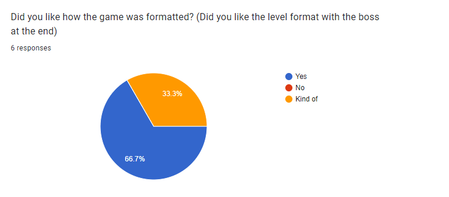

# 4.1 Evaluation of Success Criteria

## Mechanics

### Criteria

| Criterion | Description                | When was it achieved                              |
| --------- | -------------------------- | ------------------------------------------------- |
| 1         | Controls                   | [Cycle 3](../design-and-development/cycle-1-2.md) |
| 2         | Attack controls            | [Cycle 6](../design-and-development/cycle-1-5.md) |
| 3         | Camera movement            | [Cycle 3](../design-and-development/cycle-1-2.md) |
| 4         | Player Fighting Animations | Not Developed                                     |
| 5         | Player Movement Animations | Not Developed                                     |
| 6         | Power-ups                  | [Cycle 6](../design-and-development/cycle-1-5.md) |
| 7         | Enemies                    | [Cycle 5](../design-and-development/cycle-1-4.md) |

### Criterion 1

The controls were developed in a basic way using the arrow keys for the movement: left arrow for left, right arrow for right. The spacebar was also included for jumping which was needed so it could be further developed into combat.

### Criterion 2

Attack controls were successfully added where the player would use the space bar to jump on top of the enemy to defeat them. The other option was to use the left click to punch the enemy. However, there were two reasons that made the idea of jumping on the enemy make more sense. Firstly, I liked the idea of having a twist from real boxing, this is because it gave a more retro video game feel which was the aim. Secondly, the development of punching and all of the animations that would have to go into it would take a longer time, therefore, due to time constraints it made more sense to go for the space bar.

<figure><figcaption></figcaption></figure>

As it turns out from [testing](../testing/3.2-usability-testing.md), the majority of players preferred the game's twist from real boxing.

### Criterion 3



From the video, you can see that the camera is side-scrolling and follows the player. This was the plan and therefore this went successfully. There was no other plan for the camera as I had always wanted the side-scrolling camera. I always wanted it because I feel it fits the retro style of the game similar to the old Super Mario.

### Criterion 4 - Not Met

This success criteria featured the player-fighting animations. This would have been developed at the end of the development process. However, due to time constraints, I was unable to complete this criteria. It is a shame because adding these animations would have made the game feel more professional and it would have fitted perfectly to the retro style. The animations for fighting were planned in my mind, featuring a 2 frame animation, one frame for stand-still and one frame for arm-stretch-out punching. As it turns out, that plan for the fighting animations would not have worked with the final product because of the jumping style combat which I preferred.

### Criterion 5 - Not Met

Similar to the fighting animations, it would have been really good to have these animations in the game as it would have made the game suit the retro style even better. The movement animations would have been a sequence of frames for the player and the enemy characters to cycle through as they ran. However, due to time constraints, and as this was a low priority for the development of my game, I did not meet the criteria. However, this would definitely be added to the development in the future.

### Criterion 6



The water bottle power-up was coded, designed, and spawned in just how it was envisioned. This was a great success. The video shows that the player picks up the water bottle and it increases the player's hitbox to make it easier to defeat the enemy. This is exactly how it was described in the success criteria.

### Criterion 7



[Success criteria](../analysis/1.5-success-criteria.md) for enemies (Reference number 7): "Enemies will be in separate boxing rings that attempt to defeat the player. When the player enters the ring, the enemy will patrol their boxing ring. If the enemy collides with the player, the game will end. Enemies will not have the ability to jump so they cannot leave the boxing ring. This means that the player will only be fighting the enemy inside of the boxing ring."

The video shows that the success criteria are correct for the movement aspect. However, in my success criteria for enemies I mention that "If the enemy collides with the player, the game will end." however this is not how the final result ended up. This is because during development I realised that it was a mistake to add this because there was a health bar system implemented.

As you can see from this video from cycle 7, the health bar development made the success criteria incorrect.



## User Interface

### Criteria

| Criterion | Description           | When was it achieved                              |
| --------- | --------------------- | ------------------------------------------------- |
| 8         | Scoring/Timer         | Half Developed                                    |
| 9         | Menu                  | Not Developed                                     |
| 10        | Health Bar            | [Cycle 7](../design-and-development/cycle-1-6.md) |
| 11        | A timer on the HUD    | Not Developed                                     |
| 12        | Final Boss health bar | Not Developed                                     |
| 13        | Menu Theme            | Not Developed                                     |

### Criterion 8

The scoring and timer plan ended up being different to the final product. Firstly, the original plan was to have a timer for players to attempt to beat their personal record. This would have been a great incentive for the players to play my game even more. Secondly, the scoring has been developed to be a win record that displays at the top left of the screen after the player defeats an enemy. Therefore, I consider this criterion to be half-developed. For the future development of this game, I would prioritise a timing system, this is because it would be the best way to incentivise players to play the game more. Furthermore, it would allow for the future competitiveness of the game where players would compete against each other to get the fastest time and as a result, an ambitious aim of Esports for the game could be an option.

{% embed url="https://www.youtube.com/watch?v=69uoAqzMwGE&embeds_referring_euri=https%3A%2F%2Fcdn.iframe.ly%2F&source_ve_path=MjM4NTE&feature=emb_title" %}

### Criterion 9 -  Not Met

This criterion was not achieved as it links to criterion 8 and both were considered low priorities. The menu was planned so that it would have "play" and "exit" buttons. It would have also included the player's time records which were not yet developed. To be honest, this criterion would have been developed if I had more skills for making a menu, I really liked the idea of having a menu at the start of the game or an option to pause mid-game. However, due to a lack of skill, this was not developed and I prioritised other things such as the win record.

### Criterion 10

This criterion was developed very well and stuck to the plan apart from one small change. In my success criteria, I stated that I wanted the health bar to be at the top middle of the screen. However, after developing the health bar, it made more sense to me for it to be stuck above the player as the player traversed the levels.

### Criterion 11 - Not Met

Similar to criterion 8, the timer that would have been on the HUD was not developed as a result of time constraints as it was a low priority, and a lack of skills.

### Criterion 12 -  Not Met

The final boss health bar was something that would be developed if there were to be any future development of my game. The boss health bar was not developed due to a lack of skill. The skill I needed was to segregate the normal enemy from the boss and create separate functions for each. I made attempts to do so, however, I encountered several problems with the normal collision and the player jumping on top of the boss collision. Furthermore, I made attempts to create a second health bar for the boss on the top of the screen on the final level only but it did not work. Therefore the boss health bar was not developed, unfortunately. In my survey for the players of my game to fill out, I received two responses referring to when they were asked: "Did you like how the game was formatted? (Did you like the level format with the boss at the end)"

<figure><figcaption></figcaption></figure>

The second one mentions that the boss should take more hits to be defeated. This was a goal of mine in the success criteria. Therefore, a response suggesting that it should be in the game bodes well for future development which would feature a boss health bar.

### Criterion 13 - Not Met

If I did develop a menu, this criterion stated that I would give it a theme that would "add to the overall retro feel of the game". This had an even lower priority. Although, it is still a shame that the menu was not developed in the end.

## Levels and Layout

### Criteria

| Criterion | Description | When was it achieved                                                                                                                                    |
| --------- | ----------- | ------------------------------------------------------------------------------------------------------------------------------------------------------- |
| 14        | Game Layout | [Cycle 2](../design-and-development/cycle-1-1.md), [Cycle 4](../design-and-development/cycle-1-3.md), [Cycle 8](../design-and-development/cycle-1-7.md) |
| 15        | Difficultly | [Cycle 7](../design-and-development/cycle-1-6.md)                                                                                                       |

### Criterion 14

I had changed my mind about the game layout a few times. Specifically, the map layout. Firstly, I switched from using a coded plain white border as my floor with symbols to represent the tiles of the boxing rings to using only tiles for both the floor and the boxing rings. Secondly, I changed the format of the symbols that represent the tiles because it made more sense for several reasons such as the player getting stuck on the original format. However, as a result of the changes, it came to the final product which fitted quite well with what I wanted to achieve. I checked this by putting it as a question in my survey which I had addressed in [3.2 Testing](../testing/3.2-usability-testing.md):

<figure><figcaption></figcaption></figure>

The response proved that most of the players liked how the game was formatted and some gave some feedback which I had addressed.

### Criterion 15

<figure><figcaption></figcaption></figure>

From [testing](../testing/3.2-usability-testing.md), there were mixed opinions on how hard the game was to play. I had aimed for the game not to be too challenging so that it was fit for all age groups. Therefore it was good to see that the majority thought that the game was not too challenging. In the survey, 5 represented "Very easy", and 1 represented "Very difficult". It was quite interesting to see the anomaly in that someone had said that the game was very difficult. This may be caused by the fact that I did not display what the controls were before the game started. This means that it would be good to add in any future development. Furthermore, the person who suggested that the game was very difficult may have fitted in a younger age group bracket. This may mean that I have made the game too challenging for all age groups to play. On the other hand, one last possibility is that the player who said that the game was very difficult may have been playing on a worse computer. However, after testing my game seemed to run well under a lot of stress.

## Design and Graphics

### Criteria

| Criterion | Description            | When was it achieved                               |
| --------- | ---------------------- | -------------------------------------------------- |
| 16        | Background             | [Cycle 3](../design-and-development/cycle-1-2.md), |
| 17        | Graphics               | [Cycle 8](../design-and-development/cycle-1-7.md)  |
| 18        | Character Design       | [Cycle 8](../design-and-development/cycle-1-7.md)  |
| 19        | Game Completion Design | [Cycle 8](../design-and-development/cycle-1-7.md)  |

### Criterion 16&#x20;

<figure><figcaption></figcaption></figure>

The background was decided in the early cycles and has remained ever since. However, in my success criteria, I had planned to feature a properly designed background with a crowd and a boxing arena theme. However, due to time constraints, this was not done.

### Criterion 17 and 18

I aimed for my characters to be retro-pixelated to bring nostalgia to players. I had definitely achieved that.

<figure><figcaption></figcaption></figure>

I really liked the player designs that I had found/edited. But I wanted to make sure that my players agreed so I had it as one of my questions in my [testing](../testing/3.2-usability-testing.md).

<figure><figcaption></figcaption></figure>

It was very good to see that the players agreed and thought that the character design was good and suited the retro theme that I was going for. There was one person however who said that they didn't like it but they did give a reason as to why:&#x20;

<figure><figcaption></figcaption></figure>

This reason is perfectly valid as I planned to have animations in my [success criteria](../analysis/1.5-success-criteria.md). However, I have addressed the reasons behind not developing the animations. In my criterions 4 and 5 evaluations.

As for the design for the map floor, the design for the boxing rings, the design for the boxing belt, and the design for the water bottle, I believe that it is perfect for my game, following the exact same theme for my retro boxing style. Although it may look basic, I feel that it's perfect for the retro style. However, for future development, I would adjust them slightly to be more detailed, especially since future development would include a new background which would look strange behind the plain grey colour map floor.

### Criterion 19

I designed my game completion scene using falling characters which featured in the game. That was for the retro feel and I believe that it created that. In my success criteria, all mentioned that I would use the words "And New!" for when the player won the game and became champion. This was to link to real-life boxing/MMA where the announcers say that phrase when the is a newly crowned champion.



## Non-functional

### Criteria

| Criterion | Description             | When was it achieved                |
| --------- | ----------------------- | ----------------------------------- |
| 20        | FPS rate                | [3.1](../testing/3.1-robustness.md) |
| 21        | PEGI rating             | [3.1](../testing/3.1-robustness.md) |
| 22        | Runnable on web browser | [3.1](../testing/3.1-robustness.md) |

### Criterion 20

In my [success criteria](../analysis/1.5-success-criteria.md), I planned for a minimum of 15 fps. After testing, this criterion was easily met. However, this may have been due to my computer but it turns out it gets around 60 fps on most computers so still no problems there.

<figure><figcaption></figcaption></figure>

### Criterion 21

I targeted a PEGI rating of 3 so that it was accessible to more gamers from all age groups. I tested this by asking the players of my game what PEGI rating they would give it:

<figure><figcaption></figcaption></figure>

It shows that all of the players thought that the PEGI rating was 3. Meaning that I have hit this criterion

### Criterion 22

In [testing](broken-reference), my game did not crash under lots of stress, therefore my game was able to run on any web browser. However, the game did experience some bugs/glitches which I had addressed in the [3.1 Testing for Function and Robustness](../testing/3.1-robustness.md).&#x20;
